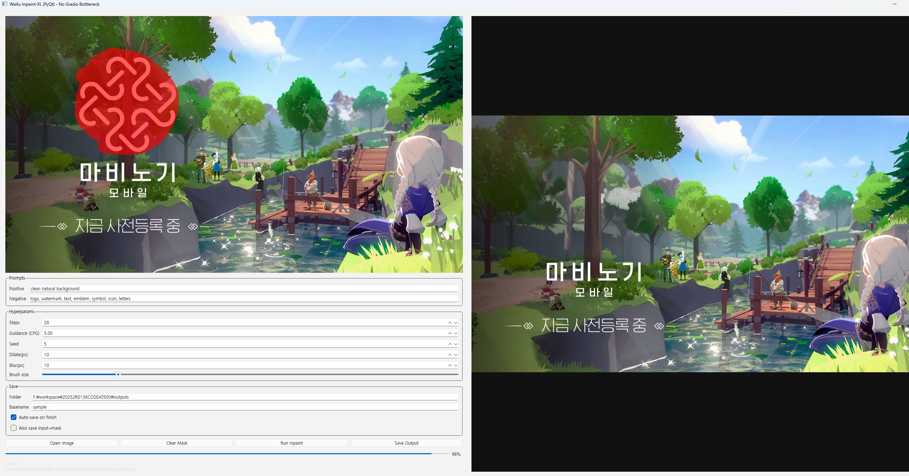
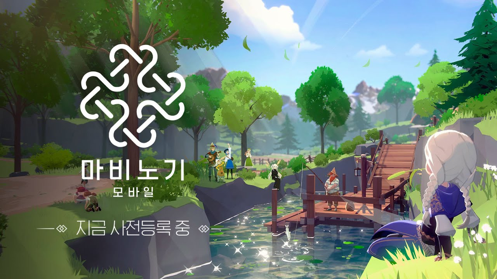
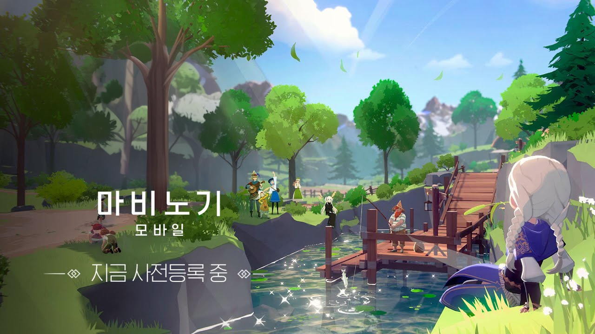

# Waifu-Inpaint-XL (Diffusers) — PyQt GUI (No Gradio Bottleneck)

Diffusers 기반 **Waifu-Inpaint-XL** 모델로 **로고/워터마크/텍스트 제거(inpainting)** 를 쉽게 할 수 있는 로컬 GUI 도구입니다.  
웹 UI(Gradio)에서 종종 발생하는 **입력/마스크 직렬화 및 전송 병목**을 피하기 위해 **PyQt(데스크탑 GUI)** 로 구현했습니다.

- ✅ 이미지 위에 **직접 마스크 드로잉**
- ✅ **Full inpaint → 마스크 영역만 합성(composite)** 로 마스크 밖 왜곡 최소화
- ✅ steps / guidance(CFG) / seed / dilate / blur 등 하이퍼파라미터 조절
- ✅ 자동 저장 + 수동 저장, 저장 로그 표시

---

## Features

- **Interactive mask painting**
  - Left click: paint (white = inpaint region)
  - Right click: erase
  - Brush size slider
- **Inpainting**
  - Diffusers `StableDiffusionXLInpaintPipeline` 기반
  - Full inpaint 후 feather mask로 합성하여 마스크 외 영역 왜곡 감소
- **Save**
  - Auto-save on finish
  - Manual save
  - Output / (optional) input+mask 저장

---

## Model

- Model: `ShinoharaHare/Waifu-Inpaint-XL`
- Pipeline: `StableDiffusionXLInpaintPipeline` (Diffusers)

---

## Installation

> Windows / Conda 기준 예시입니다. (Linux도 동일하게 동작)

### 1) Create & activate conda env (recommended)

```bash
conda create -n diffusers_pyqt python=3.10 -y
conda activate diffusers_pyqt
```

### 2) Install PyTorch (match your CUDA build)

PyTorch는 **본인 CUDA/드라이버 환경에 맞는 wheel**을 설치해야 합니다.  
아래 공식 페이지에서 설치 커맨드를 그대로 복사해서 쓰는 것을 권장합니다.

- PyTorch Get Started: https://pytorch.org/get-started/locally/
- PyTorch Previous Versions: https://pytorch.org/get-started/previous-versions/

예시(※ 예시일 뿐, 본인 환경에 맞게 PyTorch 사이트 커맨드 사용 권장):

```bash
# Example for CUDA 12.1 build (cu121)
pip install torch torchvision torchaudio --index-url https://download.pytorch.org/whl/cu121
```

### 3) Install the rest

```bash
pip install -U diffusers transformers accelerate safetensors pillow PyQt6
```

---

## Usage

```bash
python integrated.py
```

### GUI Workflow

1. **Open Image**: 이미지 로드  
2. 마스크 그리기  
   - **좌클릭**: 마스크 칠하기 (흰색 = 인페인트 영역)  
   - **우클릭**: 지우기  
   - `Brush size`로 브러시 크기 조절  
3. Prompt 입력  
   - Positive / Negative prompt  
4. 하이퍼파라미터 설정  
   - Steps, Guidance(CFG), Seed, Dilate(px), Blur(px)  
5. **Run Inpaint** 실행  
6. 결과 확인 후 저장  
   - Auto-save 체크 시 자동 저장  
   - Save Output 버튼으로 수동 저장  

### Output Files

- `{basename}_out.png` (always)
- `{basename}_input.png` (optional)
- `{basename}_mask.png` (optional)

---

## Notes / Tips

- **마스크 경계가 어색하면**: `Blur(px)`를 올려보세요.
- **경계가 비거나 들뜨면**: `Dilate(px)`를 올려보세요.
- **속도/품질 조절**
  - Steps: 20~30 사이가 보통 무난
  - CFG(guidance): 4.5~7 사이에서 조절

---

## Troubleshooting

### UI가 멈추거나 느린 경우
- 이미지 해상도가 너무 크거나 Steps가 너무 크면 VRAM이 부족할 수 있습니다.
- 다른 GPU 프로세스가 VRAM을 점유 중인지 확인하세요.

### 결과가 흐리거나 경계가 티나는 경우
- Dilate/Blur 값을 조절해 보세요.
- Negative prompt에 `logo, watermark, text, emblem, symbol, icon, letters` 등을 넣으면 도움이 됩니다.

---

## Screenshots

- **GUI overview**
  

- **Input image**
  

- **Mask**
  

- **Inpaint result**
  
